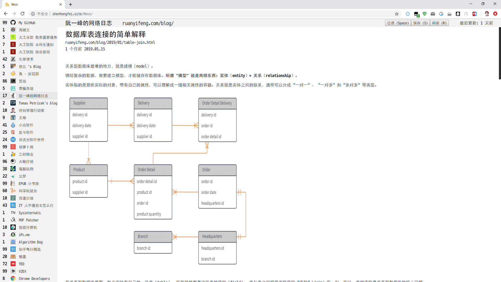

# News Hub 新闻聚合阅读 <http://shenhongfei.site/News/>

### 简介

使用爬虫技术抓取 RSS、HTML、JSON API，聚合自己关注网站的所有更新内容，统一阅读

订阅源包括高质量博客、微信公众号、微博、新闻网站、学校通知、YouTube 频道、TED 演讲

后端抓取内容、提取条目，根据标题及内容生成 Hash 来判断是否更新，记录更新时间

### 快捷键

| 按键  | 动作           |
| ----- | -------------- |
| 空格  | 转到下一个条目 |
| Tab   | 转到下一订阅源 |
| Enter | 打开原网页     |
| S     | 保存阅读进度   |
| R     | 重新加载       |

### 效果预览

### 数据

站点图标 https://1drv.ms/u/s!AhmzONd8r6bOjhWn2pv28WNdcgeE

抓取数据 https://1drv.ms/u/s!AhmzONd8r6bOjhaECY_eW-Q1TRvP

